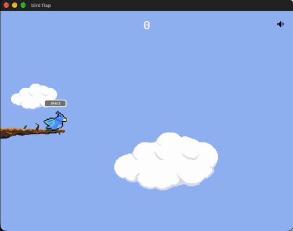

# Bird Flap

A Flappy Bird–style game built in Rust with the [Bevy](https://bevy.org/)
engine. Playable in the browser.

This is a learning project. It's my first real dive into Bevy and game development
in Rust.

## 🎮 Play

**[Play it live here](https://bird-flap-e292fa.gitlab.io/)** 

 

### Controls

| Input | Action |
|-------|--------|
| Keyboard `Space` | Flap |
| Tap (touch screen) / Left Click (Mouse) | Flap |
| 🔊 button (top-right) | Toggle sound |

## 🛠️ Built with

- [Rust](https://www.rust-lang.org/) (2024 edition)
- [Bevy](https://bevy.org/) 0.19 game engine
- [Trunk](https://trunkrs.dev/) for the WebAssembly build
- Deployed on GitLab Pages

## Running locally

### Native

```bash
cargo run --release
```

### In the browser (WebAssembly)

```bash
# One-time setup
rustup target add wasm32-unknown-unknown
cargo install --locked trunk

# Serve with hot-reload at http://localhost:8080
trunk serve --release
```

## License

- **Code** is licensed under either [MIT](LICENSE-MIT) or
  [Apache-2.0](LICENSE-APACHE), at your option.
- **Art assets** (in `assets/`) are licensed under
  [CC BY 4.0](assets/LICENSE).

## Credits

Built following [Chris Biscardi's Flappy Bird tutorial](https://www.rustadventure.dev/flappy-bird) with my own additions and twists.